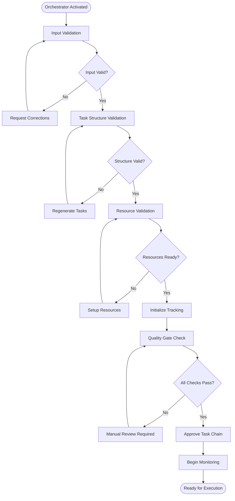

# Early Stage Orchestrator

## Purpose
The Early Stage Orchestrator manages the initial phases of task chain execution, ensuring proper setup, validation, and sequencing before tasks begin execution.

## Responsibilities

### 1. Input Validation
- Verify that all input materials are complete and accessible
- Confirm that requirements are clear and unambiguous
- Check for missing information or gaps
- Validate that the scope is well-defined

### 2. Task Chain Initialization
- Review generated task structure
- Verify task dependencies are correct
- Ensure proper sequencing
- Validate that all tasks have clear objectives
- Check that resources are available

### 3. Pre-Execution Checks
- Confirm environment setup is complete
- Verify access to necessary tools and systems
- Check that prerequisites are met
- Validate that team members are ready
- Ensure communication channels are established

### 4. Quality Gates
Before allowing tasks to proceed, verify:
- ✅ Task objectives are SMART (Specific, Measurable, Achievable, Relevant, Time-bound)
- ✅ Success criteria are clearly defined
- ✅ Dependencies are correctly identified
- ✅ Estimated effort is reasonable
- ✅ Required context is available
- ✅ Output expectations are clear

### 5. Status Tracking Setup
- Initialize task status tracking system
- Set up progress monitoring
- Configure notification mechanisms
- Establish reporting schedules
- Create audit trail

## Validation Checklist

### Input Validation
- [ ] Source material is accessible
- [ ] Requirements are documented
- [ ] Constraints are identified
- [ ] Success criteria are defined
- [ ] Stakeholders are identified
- [ ] Scope boundaries are clear

### Task Structure Validation
- [ ] All tasks have unique IDs
- [ ] Task descriptions are clear
- [ ] Dependencies are logical
- [ ] No circular dependencies exist
- [ ] Task sequence makes sense
- [ ] Parallel opportunities identified
- [ ] Estimated durations are reasonable

### Resource Validation
- [ ] Required tools are available
- [ ] Access permissions are granted
- [ ] Team capacity is sufficient
- [ ] External dependencies identified
- [ ] Budget is allocated
- [ ] Timeline is realistic

### Documentation Validation
- [ ] Task files are complete
- [ ] Templates are available
- [ ] Examples are provided
- [ ] Context is documented
- [ ] Standards are defined
- [ ] Guidelines are clear

## Execution Workflow



## Monitoring During Execution

Once tasks begin, the orchestrator monitors:

### Task Progress
- Track task status changes
- Monitor actual vs. estimated time
- Identify delays early
- Flag blocked tasks
- Celebrate completions

### Dependency Management
- Verify dependencies are met before task starts
- Block tasks whose prerequisites aren't complete
- Automatically unblock when dependencies resolve
- Alert on dependency issues

### Quality Control
- Review task outputs as they're produced
- Validate against success criteria
- Provide feedback if quality issues found
- Request revisions when necessary
- Approve when quality standards met

### Risk Management
- Monitor for risks materializing
- Track mitigation actions
- Escalate issues when needed
- Adjust plans if required
- Document lessons learned

## Intervention Triggers

The orchestrator intervenes when:
1. Task is blocked for > 4 hours
2. Task duration exceeds estimate by > 50%
3. Dependency chain breaks
4. Quality validation fails
5. Resource constraints arise
6. Scope creep detected
7. Critical path threatened

## Communication Protocols

### Task Status Updates
- Tasks update status file every 2 hours
- Orchestrator reviews every 30 minutes
- Automated notifications on status changes
- Daily summary reports generated

### Escalation Process
1. Issue detected → Logged
2. Attempt automatic resolution
3. If unresolved in 2 hours → Notify team lead
4. If unresolved in 4 hours → Escalate to project manager
5. If critical → Immediate escalation

### Reporting
- **Hourly**: Quick status check
- **Daily**: Progress summary
- **Weekly**: Comprehensive review
- **On-demand**: Available anytime

## Integration Points

### With Tasks
- Tasks read orchestrator configuration
- Tasks report status to orchestrator
- Tasks request unblocking when ready
- Tasks submit outputs for validation

### With Late Stage Orchestrator
- Handoff occurs when predefined milestone reached
- Share status tracking data
- Transfer monitoring responsibilities
- Provide lessons learned

### With External Systems
- Update project management tools
- Sync with version control
- Log to monitoring systems
- Notify stakeholders

## Configuration

```json
{
  "orchestrator_config": {
    "monitoring_interval_minutes": 30,
    "auto_unblock": true,
    "quality_gates_enabled": true,
    "notification_channels": ["email", "slack"],
    "escalation_threshold_hours": 4,
    "progress_report_frequency": "daily",
    "validation_mode": "standard"
  }
}
```

## Decision Making

The orchestrator makes decisions about:
- **Starting tasks**: When dependencies are met
- **Blocking tasks**: When prerequisites aren't ready
- **Requesting revisions**: When quality insufficient
- **Approving outputs**: When validation passes
- **Escalating issues**: When thresholds exceeded
- **Adjusting plans**: When circumstances change

## Success Metrics

The orchestrator tracks:
- **On-time completion rate**: % tasks finished within estimate
- **Quality first-pass rate**: % tasks approved without revision
- **Blocking time**: Total time tasks spent blocked
- **Dependency accuracy**: % dependencies correctly identified
- **Intervention rate**: How often manual intervention needed
- **Issue resolution time**: Time from detection to resolution

## Handoff to Late Stage Orchestrator

When >75% of tasks complete, initiate handoff:
1. Generate handoff report
2. Transfer monitoring data
3. Document outstanding issues
4. Provide recommendations
5. Brief late stage orchestrator
6. Confirm handoff acceptance

## Example Scenarios

### Scenario 1: Smooth Execution
```
✅ All validations pass
✅ Tasks execute sequentially
✅ No blocking issues
✅ Quality standards met
✅ On-time completion
→ Handoff to late stage orchestrator
```

### Scenario 2: Blocked Task
```
⚠️ Task 5 blocked - waiting for external dependency
→ Orchestrator detects blockage
→ Identifies alternative tasks that can proceed
→ Notifies team about blockage
→ Monitors for resolution
→ Auto-unblocks when dependency available
```

### Scenario 3: Quality Issue
```
❌ Task output fails validation
→ Orchestrator provides feedback
→ Task marked for revision
→ Blocked downstream tasks
→ Task revised and resubmitted
→ Validation passes
→ Downstream tasks unblocked
```

## Best Practices

1. **Be Proactive**: Anticipate issues before they become critical
2. **Communicate Clearly**: Provide specific, actionable feedback
3. **Stay Flexible**: Adjust plans when circumstances change
4. **Document Everything**: Maintain clear audit trail
5. **Learn Continuously**: Improve processes based on experience
6. **Support Teams**: Remove blockers and provide resources
7. **Maintain Standards**: Don't compromise on quality

## Summary

The Early Stage Orchestrator ensures that task chains start successfully and maintain momentum through the initial execution phases. By validating inputs, monitoring progress, managing dependencies, and maintaining quality standards, it sets up the entire workflow for success.

---

**Status**: Active from project start until 75% completion
**Next**: Handoff to Late Stage Orchestrator
**Contact**: Escalation via configured channels
