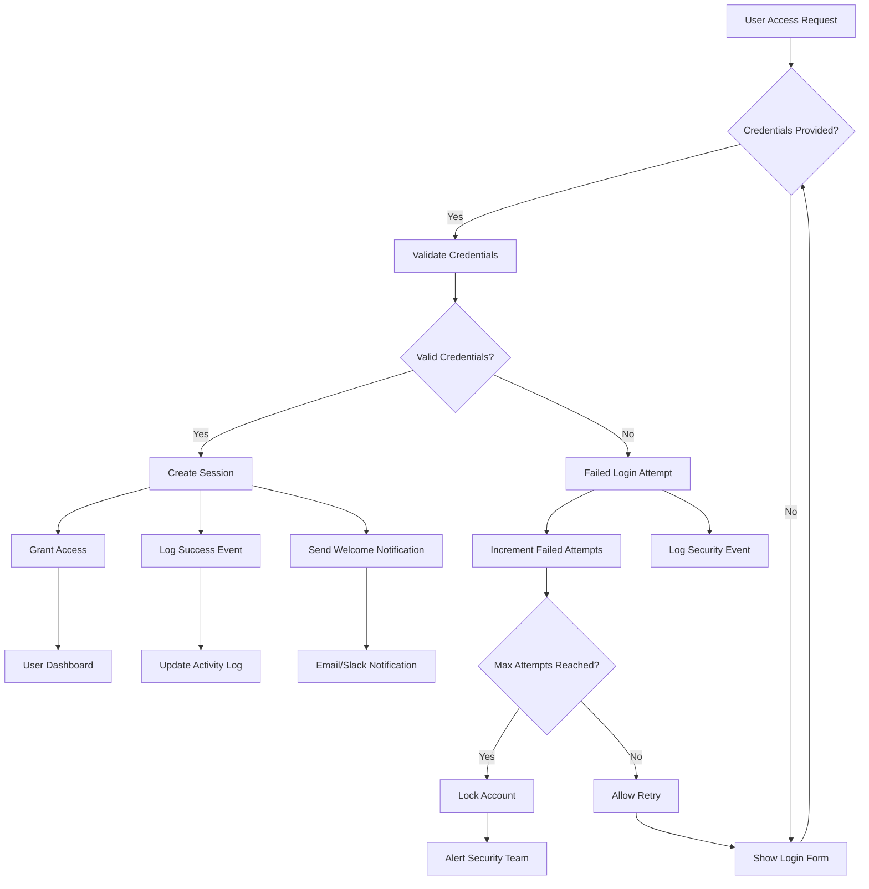
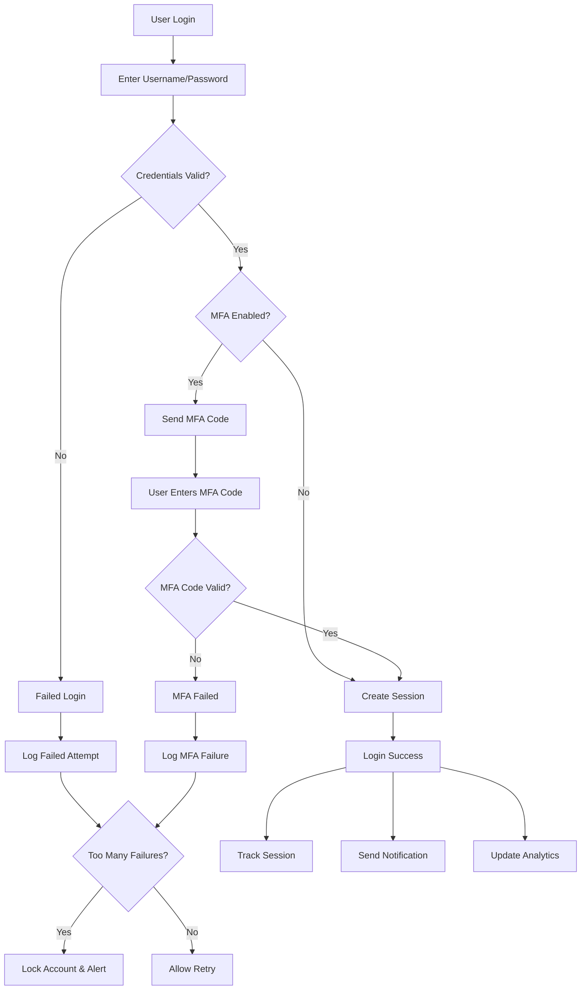

# Login Process Visualization and Automation

This document provides a comprehensive visualization and automation guide for login processes using ActivePieces workflows.

## 🔐 Login Process Overview

### What is Login Process Visualization?

Login process visualization refers to mapping out and automating the entire user authentication flow, including:
- User authentication attempts
- Success/failure tracking
- Security monitoring
- User session management
- Login notifications and alerts
- Access control automation

## 📊 Login Flow Visualization

### Basic Login Flow Diagram



### Advanced Login Flow with MFA



## 🤖 Automated Login Workflows

### 1. Login Success Notification

**Purpose**: Notify users and security team about successful logins

**Trigger**: Successful user authentication event

**Actions**:
- Send welcome email/notification to user
- Log login event to analytics
- Update user activity timestamp
- Check for unusual location/device
- Alert security if suspicious

### 2. Failed Login Monitor

**Purpose**: Track and respond to failed login attempts

**Trigger**: Failed authentication event

**Actions**:
- Increment failed attempt counter
- Log security event
- Check if threshold exceeded
- Lock account if needed
- Alert security team
- Send notification to user

### 3. Account Lockout Handler

**Purpose**: Manage locked accounts and security alerts

**Trigger**: Account locked due to failed attempts

**Actions**:
- Lock user account
- Send security alert
- Notify user via email
- Create support ticket
- Log incident
- Schedule unlock timer

### 4. Session Management

**Purpose**: Monitor and manage active user sessions

**Trigger**: Session creation/expiration

**Actions**:
- Track active sessions
- Monitor session duration
- Detect multiple concurrent sessions
- Auto-logout inactive sessions
- Send session expiry warnings

## 🔧 ActivePieces Login Automation Examples

### Example 1: Login Success Workflow

```json
{
  "name": "Login Success Handler",
  "description": "Processes successful login events",
  "trigger": {
    "type": "WEBHOOK",
    "settings": {
      "method": "POST",
      "path": "/login-success"
    }
  },
  "actions": [
    {
      "name": "Validate Login Data",
      "type": "CODE",
      "settings": {
        "input": {
          "loginData": "{{trigger.body}}"
        },
        "code": `
          const login = inputs.loginData;
          
          // Extract login information
          return {
            userId: login.userId,
            username: login.username,
            timestamp: new Date().toISOString(),
            ipAddress: login.ipAddress,
            device: login.device,
            location: login.location
          };
        `
      }
    },
    {
      "name": "Check for Suspicious Activity",
      "type": "CODE",
      "settings": {
        "input": {
          "loginInfo": "{{steps.validate_login_data.output}}"
        },
        "code": `
          const info = inputs.loginInfo;
          let isSuspicious = false;
          let reasons = [];
          
          // Check for unusual login times (e.g., 2 AM - 5 AM)
          const hour = new Date().getHours();
          if (hour >= 2 && hour <= 5) {
            isSuspicious = true;
            reasons.push('Unusual time');
          }
          
          // Check for unknown location (simplified)
          // In production, compare with user's typical locations
          
          return {
            isSuspicious: isSuspicious,
            reasons: reasons,
            loginInfo: info
          };
        `
      }
    },
    {
      "name": "Send Welcome Notification",
      "type": "PIECE",
      "settings": {
        "pieceName": "slack",
        "actionName": "send_message",
        "input": {
          "channel": "#user-activity",
          "text": "✅ User {{steps.validate_login_data.output.username}} logged in successfully from {{steps.validate_login_data.output.ipAddress}}"
        }
      }
    },
    {
      "name": "Alert Security if Suspicious",
      "type": "BRANCH",
      "settings": {
        "conditions": [
          {
            "firstValue": "{{steps.check_for_suspicious_activity.output.isSuspicious}}",
            "operator": "EQUALS",
            "secondValue": true
          }
        ]
      },
      "onSuccess": [
        {
          "name": "Send Security Alert",
          "type": "PIECE",
          "settings": {
            "pieceName": "slack",
            "actionName": "send_message",
            "input": {
              "channel": "#security-alerts",
              "text": "⚠️ SUSPICIOUS LOGIN DETECTED\nUser: {{steps.validate_login_data.output.username}}\nIP: {{steps.validate_login_data.output.ipAddress}}\nReasons: {{steps.check_for_suspicious_activity.output.reasons}}"
            }
          }
        }
      ]
    },
    {
      "name": "Log to Database",
      "type": "CODE",
      "settings": {
        "input": {
          "loginData": "{{steps.validate_login_data.output}}",
          "suspicious": "{{steps.check_for_suspicious_activity.output.isSuspicious}}"
        },
        "code": `
          // In production, save to database
          console.log('Logging login event:', inputs.loginData);
          return { logged: true };
        `
      }
    }
  ]
}
```

### Example 2: Failed Login Tracker

```json
{
  "name": "Failed Login Handler",
  "description": "Monitors and responds to failed login attempts",
  "trigger": {
    "type": "WEBHOOK",
    "settings": {
      "method": "POST",
      "path": "/login-failed"
    }
  },
  "actions": [
    {
      "name": "Process Failed Login",
      "type": "CODE",
      "settings": {
        "input": {
          "failureData": "{{trigger.body}}"
        },
        "code": `
          const failure = inputs.failureData;
          
          return {
            userId: failure.userId,
            username: failure.username,
            timestamp: new Date().toISOString(),
            ipAddress: failure.ipAddress,
            reason: failure.reason || 'Invalid credentials',
            attemptNumber: failure.attemptNumber || 1
          };
        `
      }
    },
    {
      "name": "Check Attempt Threshold",
      "type": "CODE",
      "settings": {
        "input": {
          "failureInfo": "{{steps.process_failed_login.output}}"
        },
        "code": `
          const info = inputs.failureInfo;
          const maxAttempts = 5;
          const shouldLock = info.attemptNumber >= maxAttempts;
          
          return {
            shouldLock: shouldLock,
            attemptsRemaining: Math.max(0, maxAttempts - info.attemptNumber),
            failureInfo: info
          };
        `
      }
    },
    {
      "name": "Lock Account if Needed",
      "type": "BRANCH",
      "settings": {
        "conditions": [
          {
            "firstValue": "{{steps.check_attempt_threshold.output.shouldLock}}",
            "operator": "EQUALS",
            "secondValue": true
          }
        ]
      },
      "onSuccess": [
        {
          "name": "Send Account Locked Alert",
          "type": "PIECE",
          "settings": {
            "pieceName": "slack",
            "actionName": "send_message",
            "input": {
              "channel": "#security-alerts",
              "text": "🔒 ACCOUNT LOCKED\nUser: {{steps.process_failed_login.output.username}}\nReason: Too many failed login attempts\nIP: {{steps.process_failed_login.output.ipAddress}}"
            }
          }
        },
        {
          "name": "Email User About Lockout",
          "type": "PIECE",
          "settings": {
            "pieceName": "gmail",
            "actionName": "send_email",
            "input": {
              "to": "{{steps.process_failed_login.output.email}}",
              "subject": "Account Locked - Security Alert",
              "body": "Your account has been locked due to multiple failed login attempts. Please contact support to unlock your account."
            }
          }
        }
      ]
    },
    {
      "name": "Log Failed Attempt",
      "type": "CODE",
      "settings": {
        "input": {
          "failureData": "{{steps.process_failed_login.output}}"
        },
        "code": `
          // In production, save to security log database
          console.log('Logging failed login:', inputs.failureData);
          return { logged: true };
        `
      }
    }
  ]
}
```

## 📈 Login Analytics Dashboard

### Key Metrics to Track

1. **Login Success Rate**
   - Total logins
   - Successful logins
   - Failed logins
   - Success percentage

2. **Security Metrics**
   - Failed login attempts per user
   - Accounts locked
   - Suspicious login detections
   - Geographic distribution

3. **User Activity**
   - Active users
   - Login frequency
   - Peak login times
   - Device distribution

4. **Performance Metrics**
   - Average login time
   - Authentication latency
   - Session duration
   - Concurrent users

## 🛡️ Security Best Practices

### 1. Rate Limiting
- Implement progressive delays after failed attempts
- Use CAPTCHA after 3 failed attempts
- Lock account after 5 failed attempts
- Auto-unlock after 30 minutes or manual review

### 2. Multi-Factor Authentication (MFA)
- Enable MFA for all users
- Support multiple MFA methods (SMS, email, authenticator app)
- Track MFA adoption rate
- Alert on MFA bypass attempts

### 3. Session Management
- Implement secure session tokens
- Set appropriate session timeouts
- Track concurrent sessions
- Implement secure logout

### 4. Monitoring and Alerting
- Real-time login monitoring
- Automated security alerts
- Anomaly detection
- Regular security audits

## 🔔 Notification Templates

### Success Login Email
```
Subject: Login Successful - Wallestars

Hello {{username}},

You successfully logged in to your Wallestars account.

Time: {{timestamp}}
Location: {{location}}
Device: {{device}}
IP Address: {{ipAddress}}

If this wasn't you, please contact security immediately.

Best regards,
Wallestars Security Team
```

### Failed Login Alert
```
Subject: Failed Login Attempt - Wallestars

Hello {{username}},

We detected a failed login attempt on your account.

Time: {{timestamp}}
Location: {{location}}
IP Address: {{ipAddress}}
Reason: {{reason}}

If this wasn't you, please secure your account immediately.

Best regards,
Wallestars Security Team
```

### Account Locked Notification
```
Subject: Account Locked - Security Alert

Hello {{username}},

Your account has been locked due to multiple failed login attempts.

Locked at: {{timestamp}}
Failed attempts: {{attemptCount}}
Last attempt from: {{ipAddress}}

To unlock your account:
1. Contact support at support@wallestars.com
2. Verify your identity
3. Reset your password

Best regards,
Wallestars Security Team
```

## 🚀 Implementation Checklist

### Phase 1: Basic Login Tracking
- [ ] Set up webhook endpoint for login events
- [ ] Implement login success tracking
- [ ] Implement failed login tracking
- [ ] Create basic notification workflow

### Phase 2: Security Monitoring
- [ ] Add suspicious activity detection
- [ ] Implement account lockout mechanism
- [ ] Set up security alerts
- [ ] Create incident response workflow

### Phase 3: Analytics and Reporting
- [ ] Build login analytics dashboard
- [ ] Implement daily/weekly reports
- [ ] Track key security metrics
- [ ] Create executive summary reports

### Phase 4: Advanced Features
- [ ] Implement MFA workflows
- [ ] Add geographic anomaly detection
- [ ] Create automated threat response
- [ ] Build predictive security models

## 📊 Sample Login Dashboard

```
╔══════════════════════════════════════════════════════╗
║         Login Activity Dashboard - Last 24h          ║
╠══════════════════════════════════════════════════════╣
║                                                      ║
║  Total Logins:        1,245  📈 +12% vs yesterday   ║
║  Successful:          1,198  (96.2%)                ║
║  Failed:               47    (3.8%)                 ║
║  Locked Accounts:      3                            ║
║                                                      ║
║  Peak Login Time:     9:00 AM                       ║
║  Active Users:        342                           ║
║  New Users Today:     8                             ║
║                                                      ║
║  Security Alerts:     2  ⚠️                         ║
║  MFA Enabled:         89%                           ║
║                                                      ║
╠══════════════════════════════════════════════════════╣
║  Top Countries by Logins:                           ║
║  🇺🇸 United States   - 45%                          ║
║  🇬🇧 United Kingdom  - 22%                          ║
║  🇨🇦 Canada          - 15%                          ║
║  🇩🇪 Germany         - 10%                          ║
║  🌍 Others           - 8%                           ║
╚══════════════════════════════════════════════════════╝
```

## 🔗 Integration Points

### Supported Platforms
- GitHub (for repository access)
- Slack (for notifications)
- Email (for user notifications)
- Google Analytics (for tracking)
- Datadog/New Relic (for monitoring)
- Auth0/Okta (for authentication)

### Webhook Integration
```javascript
// Example webhook payload for login event
{
  "event": "login.success",
  "timestamp": "2024-12-24T10:30:00Z",
  "user": {
    "id": "user123",
    "username": "john.doe",
    "email": "john@example.com"
  },
  "session": {
    "id": "session456",
    "ipAddress": "192.168.1.1",
    "device": "Chrome on Windows",
    "location": "New York, US"
  },
  "metadata": {
    "loginMethod": "password",
    "mfaUsed": true,
    "newDevice": false
  }
}
```

## 📚 Additional Resources

- [ActivePieces Documentation](https://www.activepieces.com/docs)
- [GitHub Authentication Guide](https://docs.github.com/en/authentication)
- [OAuth 2.0 Best Practices](https://oauth.net/2/)
- [OWASP Authentication Cheat Sheet](https://cheatsheetseries.owasp.org/cheatsheets/Authentication_Cheat_Sheet.html)

---

**Last Updated**: December 2024  
**Status**: Ready for implementation  
**Owner**: Wallestars Security Team

For questions or support, refer to the [ActivePieces Guide](ACTIVEPIECES_GUIDE.md) or contact the security team.
